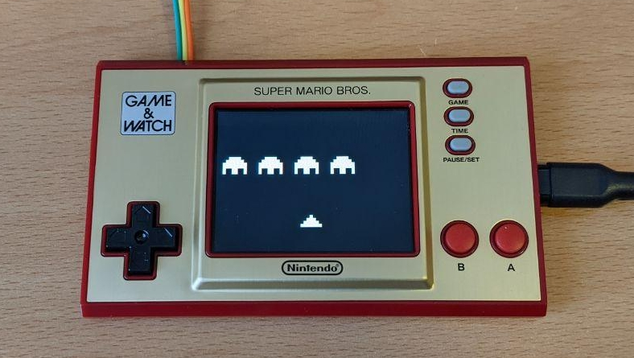

# chip8swemu

*Multiplatform CHIP-8 and Super-CHIP emulator.*

## Core

### Features

The main goal of this emulator is to be as portable as possible, so it can easily run on any machine, from small microcontrollers to desktop computers.

* Compatible with CHIP-8 and Super-CHIP games.
* Written as a library in standard C99 with no other dependencies.
* Minimal requirements, can run on anything with ~5KB of RAM available.
* Easy to port, contained in just two files: `chip8.h` and `chip8.c` 

### Compatibility

The core emulates the Super-CHIP 1.1 behavior by default, which is the most extended and supports most modern CHIP-8 and Super-CHIP games. For old games that depend on the different behavior of the original COSMAC VIP interpreter, a Compatibility Mode is provided.

Known games that require the `Compatibility Mode` *enabled*:
* Animal Race [Brian Astle].ch8
* Lunar Lander (Udo Pernisz, 1979).ch8

There are some other quirks not implemented because they also differ between original interpreters and no known game depends on them. These are well documented [here](https://github.com/Chromatophore/HP48-Superchip).

## Platforms

chip8swemu has been ported to a wide variety of platforms.

### SDL2

 

Port for the desktop based on [SDL2](http://libsdl.org) and [ImGui](https://github.com/ocornut/imgui). Features include:

* Compatible with Windows and Linux.
* Configurable CPU clock rate, 840Hz by default.
* Configurable color palette, black and white by default.
* Compatibility modes for games that require special settings.
* ROM files can be passed as an argument or dropped to the window.
* Native file selection dialog (only available on Windows).

For more information and building instructions please see: https://github.com/AlfonsoJLuna/chip8swemu/tree/master/Platform/SDL2

Compiled releases are available here: https://github.com/AlfonsoJLuna/chip8swemu/releases

### Game & Watch

Port for the [Game & Watch: Super Mario Bros.](https://en.wikipedia.org/wiki/Game_%26_Watch:_Super_Mario_Bros.)

For more information and building instructions please see: https://github.com/AlfonsoJLuna/chip8swemu/tree/master/Platform/GameAndWatch

## References

Useful resources and documentation for developing a CHIP-8 emulator:

- [CHIP-8 article on Wikipedia](https://en.wikipedia.org/wiki/CHIP-8)
- [Mastering CHIP-8](http://mattmik.com/files/chip8/mastering/chip8.html)
- [Cowgod's CHIP-8 Technical Reference](http://devernay.free.fr/hacks/chip8/C8TECH10.HTM)
- [How to write an emulator (CHIP-8 interpreter)](http://www.multigesture.net/articles/how-to-write-an-emulator-chip-8-interpreter/)
- [Super-CHIP Documentation](https://github.com/Chromatophore/HP48-Superchip)
- [Mastering SuperChip](https://github.com/JohnEarnest/Octo/blob/gh-pages/docs/SuperChip.md)
- [Awesome CHIP-8](https://github.com/tobiasvl/awesome-chip-8)
- [CHIP-8 Research Facility](https://chip-8.github.io/)
- [r/EmuDev on Reddit](https://www.reddit.com/r/EmuDev/)

## License

chip8swemu is licensed under the MIT license. See `LICENSE.md` for more information.

This repository may contain libraries or other files provided by third parties. The above license do not apply to these files.
