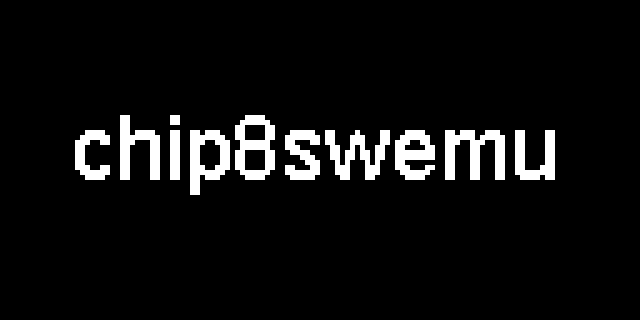

# chip8swemu

*CHIP-8 and Super-CHIP emulator core.*

## Features

* Emulator core compatible with CHIP-8 and Super-CHIP games.
* Written as a library in standard C99 with no other dependencies.
* Easy to port, contained in just two files: `chip8.h` and `chip8.c` 
* Minimal requirements, can run on anything with a 128x64 display and ~5KB of RAM available.

## Platforms

This repository only contains the emulator core. Additional frontend code is required to run on a specific platform.

chip8swemu has been ported to a wide variety of platforms, from small microcontrollers to desktop computers. Here is a list of some of these ports, you can use them as an example of how to port it to your own device:

| Repository                                                         | Author                                          | Platform                        |
| ------------------------------------------------------------------ | ----------------------------------------------- | ------------------------------- |
| [chip8swemu-sdl2](https://github.com/AlfonsoJLuna/chip8swemu-sdl2) | [AlfonsoJLuna](https://github.com/AlfonsoJLuna) | Desktop (Windows, Linux)        |
| [chip8swemu-gaw](https://github.com/AlfonsoJLuna/chip8swemu-gaw)   | [AlfonsoJLuna](https://github.com/AlfonsoJLuna) | Game & Watch: Super Mario Bros. |
| [chip8stm32](https://github.com/AlfonsoJLuna/chip8stm32)           | [AlfonsoJLuna](https://github.com/AlfonsoJLuna) | STM32F103CB (Custom PCB)        |

> Have you ported chip8swemu to another device? Feel free to send a PR to add it here.

## Compatibility

The core provides two configurable options: `Compatibility Mode` and `Vertical Wrap`, both disabled by default. When these options are disabled, the core emulates the Super-CHIP 1.1 behavior, which is the most extended and supports most modern CHIP-8 and Super-CHIP games. For old games that depend on the different behavior of the original COSMAC VIP interpreter, these two options should be enabled.

Known games that require the `Compatibility Mode` and `Vertical Wrap` *enabled*:
* Animal Race [Brian Astle].ch8
* Lunar Lander (Udo Pernisz, 1979).ch8

There are some other quirks not implemented because they also differ between original interpreters and no known game depends on them. These are well documented [here](https://github.com/Chromatophore/HP48-Superchip).

## References

Useful resources and documentation for developing a CHIP-8 emulator:

- [CHIP-8 article on Wikipedia](https://en.wikipedia.org/wiki/CHIP-8)
- [Mastering CHIP-8](http://mattmik.com/files/chip8/mastering/chip8.html)
- [Cowgod's CHIP-8 Technical Reference](http://devernay.free.fr/hacks/chip8/C8TECH10.HTM)
- [How to write an emulator (CHIP-8 interpreter)](http://www.multigesture.net/articles/how-to-write-an-emulator-chip-8-interpreter/)
- [Super-CHIP Documentation](https://github.com/Chromatophore/HP48-Superchip)
- [Mastering SuperChip](https://github.com/JohnEarnest/Octo/blob/gh-pages/docs/SuperChip.md)
- [Awesome CHIP-8](https://github.com/tobiasvl/awesome-chip-8)
- [CHIP-8 Research Facility](https://chip-8.github.io/)
- [r/EmuDev on Reddit](https://www.reddit.com/r/EmuDev/)
