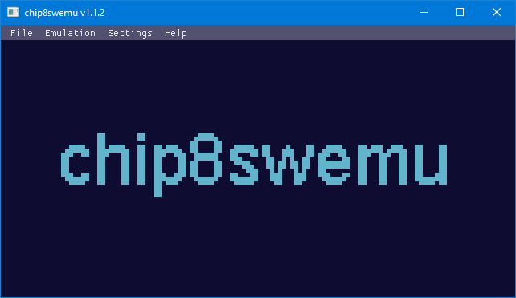
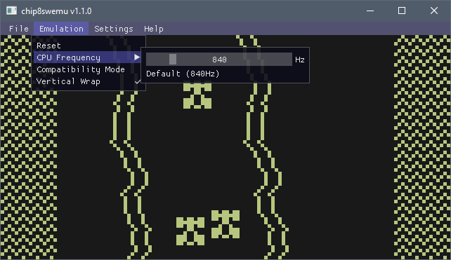
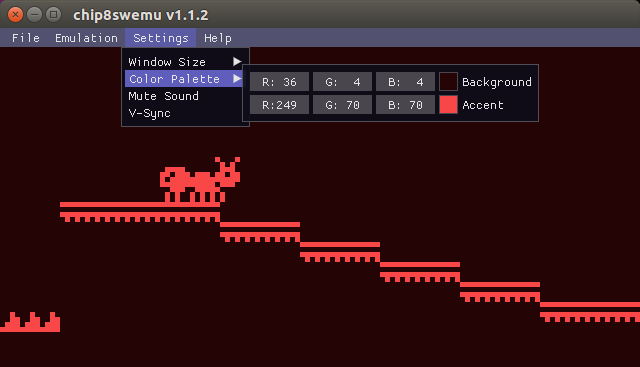

# chip8swemu

*Multiplatform CHIP-8 and Super-CHIP emulator.*

Compiled releases are available here: https://github.com/AlfonsoJLuna/chip8swemu/releases

 |  | 
:------------------------: | :------------------------: | :------------------------:

## Features

The emulator core is a CHIP-8 and Super-CHIP interpreter library written in standard C99 with no other dependencies. It can be easily included in any project adding the `chip8.h` and `chip8.c` files and can run on most machines from microcontrollers to desktop computers.

The frontend runs on both Windows and Linux. It is written in C and C++ and based on [SDL2](http://libsdl.org) and [ImGui](https://github.com/ocornut/imgui). Its features include:

* Configurable CPU clock rate, 840Hz by default.
* Configurable color palette, black and white by default.
* Compatibility modes for games that require special settings.
* ROM files can be passed as an argument or dropped to the window.
* Native file selection dialog (only available on Windows).

## Building

Required dependencies are ImGui, SDL2, OpenGL.

### How to build on Windows

1. [Install](https://git-scm.com/downloads) git and clone this repository.
2. Download and install the mingw-w64 toolchain. Prebuilt binaries are available [here](https://gnutoolchains.com/mingw64/). Be sure you check `Add to PATH` during installation.
3. [Download](https://www.libsdl.org/release/SDL2-devel-2.0.12-mingw.tar.gz) SDL 2.0.12 libraries for MinGW and extract them to `chip8swemu/frontend/libraries/SDL2-2.0.12/...`
4. [Download](https://github.com/ocornut/imgui/archive/v1.52.zip) ImGui 1.52 source code and extract it to `chip8swemu/frontend/libraries/imgui-1.52/...`
5. Open a command prompt in `chip8swemu/frontend/` and type: `mingw32-make`.

### How to build on Linux (Ubuntu)

1. Install git: `sudo apt-get install git`
2. Clone this repository: `git clone https://github.com/AlfonsoJLuna/chip8swemu`
3. Install SDL2 development libraries: `sudo apt-get install libsdl2-dev`
4. [Download](https://github.com/ocornut/imgui/archive/v1.52.zip) ImGui 1.52 source code and extract it to `chip8swemu/frontend/libraries/imgui-1.52/...`
5. Open a terminal in `chip8swemu/frontend/` and type: `make`.

## Compatibility

Some games require special settings to run properly, you need to change the options before loading the game to take effect.

Known games that require the `Compatibility Mode` *enabled*:
* Animal Race [Brian Astle].ch8

Known games that require the `Vertical Wrap` *disabled*:
* Blitz [David Winter].ch8
* Mines! - The minehunter [David Winter, 1997].ch8

There are some other quirks not implemented because they also differ between original interpreters and no known game depends on them. These are well documented [here](https://github.com/Chromatophore/HP48-Superchip).

## References

Useful resources and documentation for developing a CHIP-8 emulator:

- [CHIP-8 article on Wikipedia](https://en.wikipedia.org/wiki/CHIP-8)
- [Mastering CHIP-8](http://mattmik.com/files/chip8/mastering/chip8.html)
- [Cowgod's CHIP-8 Technical Reference](http://devernay.free.fr/hacks/chip8/C8TECH10.HTM)
- [How to write an emulator (CHIP-8 interpreter)](http://www.multigesture.net/articles/how-to-write-an-emulator-chip-8-interpreter/)
- [Mastering SuperChip](https://github.com/JohnEarnest/Octo/blob/gh-pages/docs/SuperChip.md)
- [Super-CHIP Documentation](https://github.com/Chromatophore/HP48-Superchip)
- [EmuDev on Reddit](https://www.reddit.com/r/EmuDev/)
